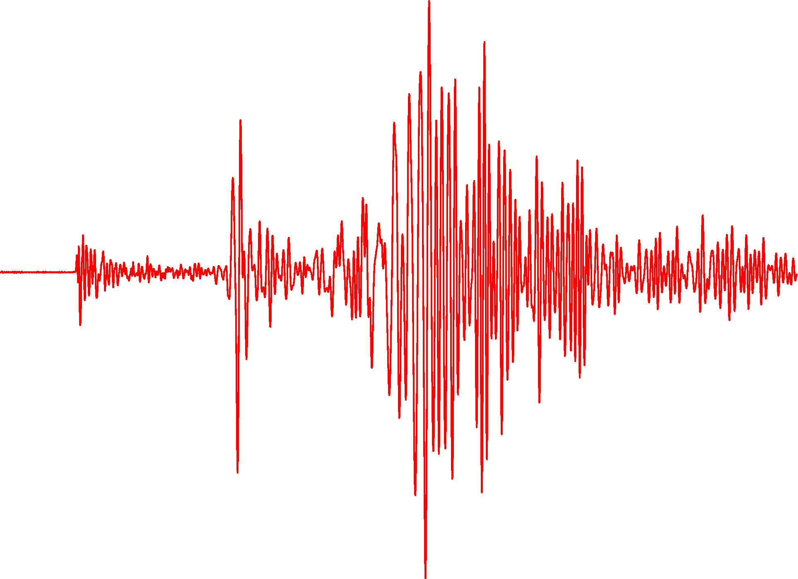

# SAC参考手册

[在线阅读](https://seisman.github.io/SAC_Docs_zh/) |
[PDF下载](https://seisman.github.io/SAC_Docs_zh/SAC_Docs.pdf) |
[文档源码](https://github.com/seisman/SAC_Docs_zh)

《SAC参考手册》是介绍地震学常用软件 [SAC](http://ds.iris.edu/ds/nodes/dmc/forms/sac/)
用法的中文手册。

## 参与维护

本项目由 [seisman](https://github.com/seisman) 发起，目前由志愿者负责维护。

欢迎更多SAC用户参与到本项目的维护中。具体的维护工作包括：

- 校对错别字、病句等等
- 校对排版问题
- 完善部分未翻译的命令，以及个别命令中未翻译的部分
- 随着SAC新版本的发布，更新手册中相应的内容
- 补充命令示例以及脚本示例
- 补充其他尚未包含在手册中的与SAC相关的知识点
- 文档结构的调整
- 项目源码的优化

可以通过三种方式参与到项目的维护中：

1. 发邮件发送给 [seisman.info@gmail.com]()
2. 在项目主页提交Issue
3. 在项目主页提交Pull Request，详情见 [Wiki](https://github.com/seisman/SAC_Docs_zh/wiki)

## 许可协议

本项目的文档部分采用[知识共享署名-非商业性使用 4.0 国际许可协议 (CC BY-NC 4.0)](https://creativecommons.org/licenses/by-nc/4.0/deed.zh)。
任何人都可以自由地分享、修改本作品，但必须遵循如下条件：

- 署名：必须提到原作者，提供指向此许可协议的链接，表明是否有做修改
- 非商业性使用：不能对本作品进行任何形式的商业性使用

本项目中的脚本遵循 [CC0 1.0 通用 (CC0 1.0)](https://creativecommons.org/publicdomain/zero/1.0/deed.zh) 许可协议。
即所有脚本放弃一切权利，全归公共领域。任何人可以自由无限制地使用、修改、共享本项目中的脚本。
